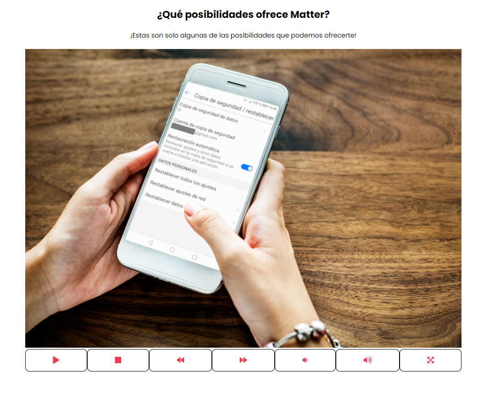
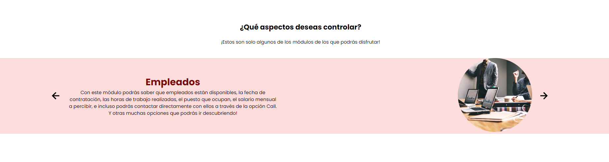
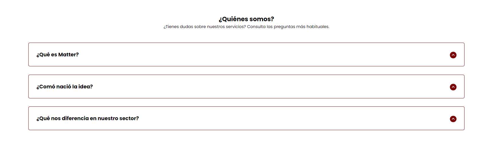
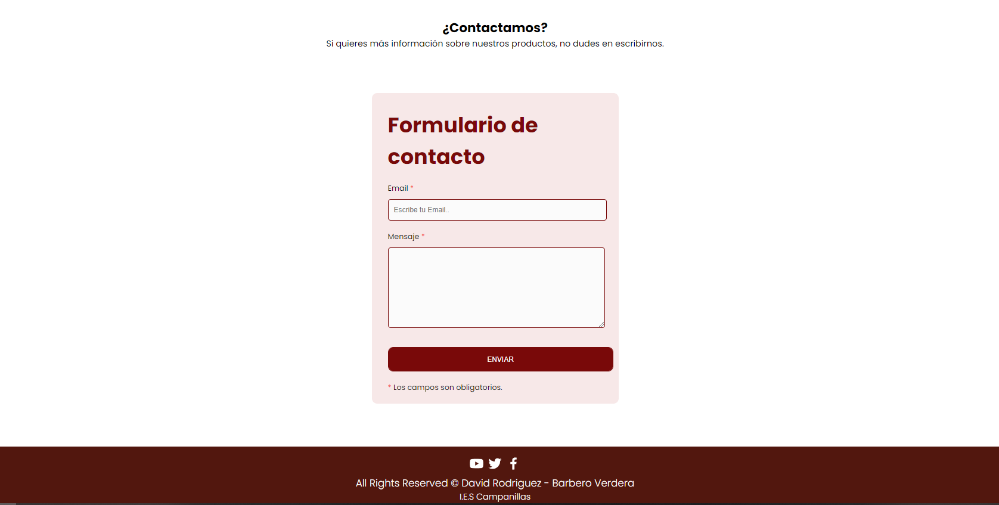

<h2 align="center">PROYECTO GRADO SUPERIOR EN DESARROLLO DE APLICACIONES MULTIPLATAFORMA I.E.S. CAMPANILLAS 21/22</h2>

  
  <h3 align="center">Landing Page Matter</h3>

## INTRODUCCIÓN
Siendo otro de los pilares básicos que componen la estructura de este proyecto, Matter Landing es
la encargada de hacernos visible a nuestro público. Una web donde podrás consultar las ventajas que
ofrece nuestro producto, y las posibilidades derivadas del uso del mismo. Aquí podrás informarte de las
novedades en nuestros servicios, así como las funcionalidades que lo componen.

## OBJETIVO
La finalidad que debe cumplir esta parte del proyecto es dar información sobre este producto de manera somera,
destacando los puntos fuertes que nos hacen descatar y ofreciendo a nuestro cliente una visión general de nuestra
empresa y nuestros productos.

## DESARROLLO
Esta parte del proyecto será desarrollada integramente con CSS, HTML y Javascript, sin hacer uso de librería o componentes
ajenos a los tres elementos mencionados, salvo en el caso del tratamiento en elementos de tipo SVG y Canvas.

## DOCUMENTO DE DISEÑO

- <a href="media/MatterFigmaDRBV.pdf">
Diseño Pdf
</a>

## DIARIO DE TRABAJO

- <a href="https://github.com/Davidrbv/Matters/blob/master/README.md">
Pulse aquí.
</a>

## BIBLIOGRAFÍA
  - <a href="https://developer.mozilla.org/es/docs/Web/JavaScript">
Javascript
</a>
  - <a href="https://animejs.com/">
AnimaJs
</a>
  - <a href="https://developer.mozilla.org/es/docs/Web/HTML">
Html
</a>
  - <a href="https://developer.mozilla.org/es/docs/Web/CSS">
Css
</a>
  - <a href="https://es.stackoverflow.com/">
StackOverflow
</a>
  - <a href="https://www.w3schools.com/">
W3Schools
</a>
  - <a href="https://w3.unpocodetodo.info//">
UnPocoDeTodo
</a>
  - <a href="https://cssgradient.io//">
CssGradient
</a>
  - <a href="https://https://dribbble.com/.io//">
Dribbble
</a>

## Mockup App

- 
En esta primera imagen se puede observar la barra de navegación de la página, desde la que tendremos acceso a los diferentes elementos que componen la parte más comercial del proyecto.

- 
Haciendo Scroll, o pinchando sobre el botón inicio, llegaremos al video de presentación de la aplicación, donde contaremos con los botones para controlar la reproducción del medio, así como su ampliación y reducción.

- 
En la siguiente imagen se muestra el slider que nos permitirá obtener información sobre los diferentes servicios que nos proporciona el uso de nuestra aplicación, y las ventajas que pueden ofrecer a nuestros clientes.

- 
A continuación, se muestra la imagen de la sección de información relativa a la empresa. Contiene un desplegable por cada uno de los elementos que componen dicha sección donde podremos encontrar información de relevancia sobre la empresa, la idea de negocio y su diferenciación en el mercado.

- 
Para finalizar, podemos observar el formulario de contacto a través del cual, los clientes o futuros clientes pueden solicitar información adicional en caso de estar interesados en el producto.

